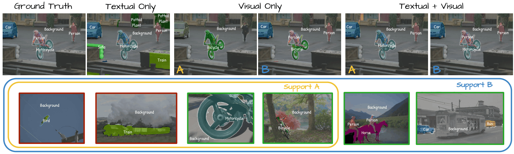

<div align="center">

# Retrieve and Segment (RNS)
## Are a Few Examples Enough to Bridge the Supervision Gap in Open-Vocabulary Segmentation?

**CVPR 2026 - Highlight 🌟⭐🌟**

[**Tilemachos Aravanis**](https://cmp.felk.cvut.cz/~aravatil/) · [**Vladan Stojnić**](https://stojnicv.xyz/) · [**Bill Psomas**](https://billpsomas.github.io/) · [**Nikos Komodakis**](https://www.csd.uoc.gr/~komod/) · [**Giorgos Tolias**](https://cmp.felk.cvut.cz/~toliageo/)

<p align="center">
  
</p>

[](https://arxiv.org/abs/2602.23339)

</div>

Official implementation of **Retrieve and Segment: Are a Few Examples Enough to Bridge the Supervision Gap in Open-Vocabulary Segmentation.**

---

## Dataset preparation

Please follow the dataset download and preparation instructions from the
[CLIP-DINOiser repository](https://github.com/wysoczanska/clip_dinoiser). Place the dataset folders under ./data directory.

We currently support ```voc cityscapes ade20k coco_stuff coco_object context context59```

## Setup

The steps below create the environment, install PyTorch, and other dependencies.

### 1. Create the conda environment

```bash
conda create -n RNS python=3.13
conda activate RNS
```

### 2. Torch and FAISS Installation 

```bash
pip install torch==2.7.1 torchvision==0.22.1 torchaudio==2.7.1 --index-url https://download.pytorch.org/whl/cu128
conda install -c pytorch faiss-gpu==1.12.0
```

**Comment:** Tailor to your CUDA version.

### 3. Other Requirements

```bash
pip install -r requirements.txt
```

## Run the Code

### DINOv3.txt (ViT-L/16) as backbone

```bash
torchrun --nproc_per_node=1 --nnodes=1 ./main_eval.py dinov3txt.yaml
```

**Comment:** To use DINOv3.txt please paste your personal download URLs for the backbone weights (dinov3_vitl16_pretrain_lvd1689m) and the .txt model weights (dinov3_vitl16_dinotxt_vision_head_and_text_encoder) in ```models/dinov3_txt_ovss/dinov3_txt_ovss.py``` line 14.

### OpenCLIP (ViT-B/16) as backbone

```bash
torchrun --nproc_per_node=1 --nnodes=1 ./main_eval.py clip.yaml
```

### SAM2.1 Mask Proposals

To add SAM2.1 as a Mask proposer please download ```sam2.1_hiera_large.pt``` from https://github.com/facebookresearch/sam2 and place it under ```./checkpoints``` directory. You should also add ```SAM``` in ```model.backbones``` list within the config. Masks are saved under ```./SAM_Masks``` and then reused.

## Reproduction

To construct the support sets in the full support experiments we used ```seeds=(100 18 42 84 92 256 512 1024)``` for ```voc cityscapes``` and ```seeds=(100 18 42 84)``` for the rest of the datasets. in the partial support experiments we used ```seeds=(100 18 42 84 92 128 256 512 1024 2048 5096 8192 16384 32768 65536 131072)``` for ```voc cityscapes``` and ```seeds=(100 18 42 84 92 256 512 1024)``` for the rest of the datasets. The seed for the support set sampling is set in the configs.

## Citation

If you find this repository useful, please cite:

```bibtex
@inproceedings{retrieveandsegment2026,
  title={Retrieve and Segment: Are a Few Examples Enough to Bridge the Supervision Gap in Open-Vocabulary Segmentation?},
  author={Aravanis, Tilemachos and Stojni{\'c}, Vladan and Psomas, Bill and Komodakis, Nikos and Tolias, Giorgos},
  booktitle={Proceedings of the IEEE/CVF Conference on Computer Vision and Pattern Recognition},
  year={2026}
}
```

## Acknowledgements

This project builds upon the following open-source projects and pretrained models. We thank the authors for making their code and models publicly available.

In particular, we acknowledge:

- [CLIP-DINOiser](https://github.com/wysoczanska/clip_dinoiser)
- [SAM3](https://github.com/facebookresearch/sam3)
- [DINOv3](https://github.com/facebookresearch/dinov3)
