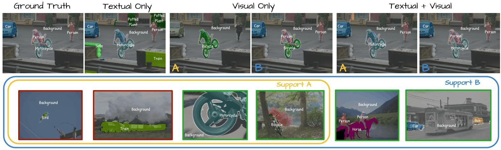

<div align="center">

# Retrieve and Segment (RNS)
## Are a Few Examples Enough to Bridge the Supervision Gap in Open-Vocabulary Segmentation?

**CVPR 2026 - Highlight 🌟⭐🌟**

[**Tilemachos Aravanis**](https://cmp.felk.cvut.cz/~aravatil/) · [**Vladan Stojnić**](https://stojnicv.xyz/) · [**Bill Psomas**](https://billpsomas.github.io/) · [**Nikos Komodakis**](https://www.csd.uoc.gr/~komod/) · [**Giorgos Tolias**](https://cmp.felk.cvut.cz/~toliageo/)

<p align="center">
  
</p>

[](https://vrg.fel.cvut.cz/rns/)
[](https://arxiv.org/abs/2602.23339)

</div>

Official implementation of **Retrieve and Segment: Are a Few Examples Enough to Bridge the Supervision Gap in Open-Vocabulary Segmentation.**

**TL;DR:** RNS is a retrieval-augmented **test-time adapter** for open-vocabulary segmentation (OVS). It augments the usual textual prompts (class names) with a small **visual support set** of pixel-annotated images — as few as **one image per class**. For each test image, RNS retrieves the most relevant visual support features and trains a lightweight per-image linear classifier that fuses them with textual class features, on top of **frozen** VLM features (no backbone training). Test-time training takes well under a second per image on an A100. RNS handles full and partial support (classes missing visual examples or even class names), supports continually expanding support sets, and significantly narrows the gap between zero-shot and fully supervised segmentation while preserving open-vocabulary ability.

---

## Setup

The steps below create the environment, install PyTorch and FAISS, and other dependencies.

### 1. Create the conda environment

```bash
conda create -n RNS python=3.13
conda activate RNS
```

### 2. Torch and FAISS installation

```bash
pip install torch==2.7.1 torchvision==0.22.1 torchaudio==2.7.1 --index-url https://download.pytorch.org/whl/cu128
conda install -c pytorch faiss-gpu==1.12.0
```

**Comment:** Tailor to your CUDA version.

### 3. Other requirements

```bash
pip install -r requirements.txt
```

A single GPU is assumed; the code does not use distributed inference (keep `--nproc_per_node=1`).

## Dataset preparation

Please follow the dataset download and preparation instructions from the
[CLIP-DINOiser repository](https://github.com/wysoczanska/clip_dinoiser). Place the dataset folders under the `./data` directory. The configs expect the following layout:

```
data
├── VOCdevkit
│   ├── VOC2012            # voc
│   └── VOC2010            # context, context59
├── coco_stuff164k         # coco_stuff, coco_object
├── cityscapes             # cityscapes
└── ADEChallengeData2016   # ade20k
```

Supported benchmarks (config key → dataset): `voc` (PASCAL VOC, 21 classes), `context` (PASCAL Context, 60), `context59` (PASCAL Context-59, 59), `coco_object` (COCO Object, 81), `coco_stuff` (COCO-Stuff, 171), `cityscapes` (19), `ade20k` (ADE20K, 150).

Support images are sampled from the **training** split of each benchmark; evaluation runs on the **validation** split.

## Run the code

### DINOv3.txt (ViT-L/16) as backbone

```bash
torchrun --nproc_per_node=1 --nnodes=1 ./main_eval.py dinov3txt.yaml
```

**Comment:** The DINOv3 weights are gated. Request access via the [DINOv3 repository](https://github.com/facebookresearch/dinov3), then paste your personal download URLs into the `backbone` (`dinov3_vitl16_pretrain_lvd1689m`) and `weights` (`dinov3_vitl16_dinotxt_vision_head_and_text_encoder`) variables at the top of `DINOV3_TXT.__init__` in [`models/dinov3_txt_ovss/dinov3_txt_ovss.py`](models/dinov3_txt_ovss/dinov3_txt_ovss.py).

### OpenCLIP (ViT-B/16) as backbone

```bash
torchrun --nproc_per_node=1 --nnodes=1 ./main_eval.py clip.yaml
```

The OpenCLIP weights (`laion2b_s34b_b88k`) are downloaded automatically on first run.

### Choosing datasets and overriding options

Both configs evaluate on `voc` by default. To evaluate on other benchmarks, edit `evaluate.task` in the config, or override any option from the command line (the configs are composed with [Hydra](https://hydra.cc/)):

```bash
# evaluate on ADE20K
torchrun --nproc_per_node=1 --nnodes=1 ./main_eval.py clip.yaml evaluate.task=[ade20k]

# 5 support images per class, different support seed
torchrun --nproc_per_node=1 --nnodes=1 ./main_eval.py clip.yaml \
    support.images_per_class=5 support.support_seed=42

# partial visual support: drop visual examples for 50% of the classes
torchrun --nproc_per_node=1 --nnodes=1 ./main_eval.py clip.yaml support.drop_classes_fraction=0.5
```

### SAM 2.1 region proposals

By default, RNS predicts at the **patch level**. To use SAM 2.1 region proposals instead:

1. Download `sam2.1_hiera_large.pt` from the [SAM 2 repository](https://github.com/facebookresearch/sam2) and place it under the `./checkpoints` directory.
2. Add `SAM` to the `model.backbones` list in the config (this loads the SAM model), **and** set `method.mask_proposal_strategy: "SAM"` (this enables region-level prediction). Both are required.

Generated masks are cached under `./SAM_Masks/<backbone>/<dataset>/` and reused on subsequent runs. **Note:** the cache is keyed by the position of the image in the evaluation order, so delete `./SAM_Masks` if you change the test split or its ordering.

## Configuration

The main options, and how they map to the paper:

| Config key | Paper | Meaning |
|---|---|---|
| `support.images_per_class` | $B$ | Support images sampled per class |
| `support.support_seed` | — | Seed for support-set sampling |
| `support.max_samples` | — | Cap on the train-split pool the support set is sampled from |
| `support.k` | $K$ | Number of neighbors in k-NN retrieval |
| `support.drop_classes_fraction` | partial visual support | Fraction of classes without visual examples |
| `support.drop_text_fraction` | partial textual support | Fraction of classes without class names |
| `method.use_text` | w/o text variant | Use textual support (`false` = visual-only RNS) |
| `method.class_score_temperature` | Eq. 8 | Temperature of the class relevance weights $w_c$ |
| `method.beta_mixed` | $\beta_f$ | Weight of the fused support loss |
| `method.beta_pseudo` | $\beta_p$ | Weight of the pseudo-label loss (partial visual support) |
| `method.lr`, `method.epochs` | — | Test-time training of the per-image linear classifier (full-batch) |
| `method.mask_proposal_strategy` | Sec. 3.6 | `"None"` = patch-level, `"SAM"` = region-level predictions |
| `support.crop_sizes`, `support.strides`, `support.scales` | — | Sliding-window feature extraction for support images |
| `test.test_crop_size`, `test.test_crop_stride`, `test.scales` | — | Sliding-window feature extraction at test time |

## Results

mIoU (%) with full textual and visual support, averaged over support-set seeds (see [Reproduction](#reproduction)). $B$ is the number of support images per class.

**OpenCLIP ViT-B/16 + SAM 2.1** (region-level)

| Method | VOC | Context | Object | Stuff | City | ADE | Avg. |
|---|---|---|---|---|---|---|---|
| Zero-shot | 52.85 | 34.00 | 28.05 | 26.63 | 37.88 | 22.83 | 33.71 |
| RNS $B{=}1$ | 69.72 | 39.41 | 38.48 | 28.55 | 47.88 | 28.73 | 42.13 |
| RNS $B{=}20$ | 75.94 | 48.94 | 45.48 | 37.23 | 53.45 | 38.83 | 49.98 |

**DINOv3.txt ViT-L/16, patch-level** (the shipped `dinov3txt.yaml` defaults)

| Method | VOC | Context | Object | Stuff | City | ADE | Avg. |
|---|---|---|---|---|---|---|---|
| RNS $B{=}1$ | 65.63 | 40.34 | 41.34 | 32.62 | 51.83 | 33.45 | 44.20 |
| RNS $B{=}20$ | 74.85 | 49.84 | 46.54 | 40.44 | 54.33 | 42.46 | 51.41 |

**DINOv3.txt ViT-L/16 + SAM 2.1** (region-level)

| Method | VOC | Context | Object | Stuff | City | ADE | Avg. |
|---|---|---|---|---|---|---|---|
| Zero-shot | 31.35 | 31.03 | 28.92 | 28.50 | 39.29 | 27.75 | 31.14 |
| RNS $B{=}1$ | 74.98 | 45.58 | 46.88 | 35.66 | 60.97 | 37.41 | 50.25 |
| RNS $B{=}20$ | 81.31 | 55.01 | 53.33 | 44.48 | 64.43 | 48.16 | 57.79 |

**Note:** the paper's OpenCLIP results use SAM 2.1 region proposals; to reproduce them, enable SAM as described above. A single-seed run will deviate slightly from the averaged numbers.

### Runtime

On a single NVIDIA A100 (DINOv3.txt, 448×448 crops), test-time training and inference of RNS take **~0.8 s per test image** at the patch level. SAM 2.1 mask generation adds ~1.5 s per image (cached after the first run), and textual class features are extracted once per dataset (~7 s for VOC, ~51 s for ADE20K). See the supplementary material for the full breakdown.

## Reproduction

To construct the support sets in the full support experiments we used `seeds=(100 18 42 84 92 256 512 1024)` for `voc cityscapes` and `seeds=(100 18 42 84)` for the rest of the datasets. In the partial support experiments we used `seeds=(100 18 42 84 92 128 256 512 1024 2048 5096 8192 16384 32768 65536 131072)` for `voc cityscapes` and `seeds=(100 18 42 84 92 256 512 1024)` for the rest of the datasets. Reported numbers are averaged over these seeds. The seed is set via `support.support_seed` (in the configs or from the command line, see above).

## License

This project is released under the [MIT License](LICENSE).

## Citation

If you find this repository useful, please cite:

```bibtex
@inproceedings{retrieveandsegment2026,
  title={Retrieve and Segment: Are a Few Examples Enough to Bridge the Supervision Gap in Open-Vocabulary Segmentation?},
  author={Aravanis, Tilemachos and Stojni{\'c}, Vladan and Psomas, Bill and Komodakis, Nikos and Tolias, Giorgos},
  booktitle={Proceedings of the IEEE/CVF Conference on Computer Vision and Pattern Recognition},
  year={2026}
}
```

## Acknowledgements

### Code and models

This project builds upon the following open-source projects and pretrained models. We thank the authors for making their code and models publicly available.

- [CLIP-DINOiser](https://github.com/wysoczanska/clip_dinoiser)
- [SAM2](https://github.com/facebookresearch/sam2)
- [DINOv3](https://github.com/facebookresearch/dinov3)

### Funding

This work was supported by:

- [Czech Technical University in Prague](https://www.cvut.cz/en), grant No. SGS23/173/OHK3/3T/13
- The EU [Horizon Europe](https://research-and-innovation.ec.europa.eu/funding/funding-opportunities/funding-programmes-and-open-calls/horizon-europe_en) programme, [MSCA Postdoctoral Fellowship RAVIOLI](https://cordis.europa.eu/project/id/101205297) (No. 101205297)
- The [Junior Star grant](https://starfos.tacr.cz/en/vysledky-vyzkumu?query=skbyaadwnkha) GM 21-28830M of the [Czech Science Foundation (GAČR)](https://gacr.cz/en/)

### Computational resources

We acknowledge [VSB – Technical University of Ostrava](https://www.vsb.cz/en) and [IT4Innovations National Supercomputing Center](https://www.it4i.cz/en), Czech Republic, for awarding this project (OPEN-33-67) access to the [LUMI supercomputer](https://www.lumi-supercomputer.eu/), owned by the [EuroHPC Joint Undertaking](https://eurohpc-ju.europa.eu/), hosted by [CSC](https://csc.fi/en/) (Finland) and the LUMI consortium, through the [Ministry of Education, Youth and Sports of the Czech Republic](https://msmt.gov.cz/) via the [e-INFRA CZ](https://www.e-infra.cz/en) project (ID: 90254).

The access to the computational infrastructure of the OP VVV funded project CZ.02.1.01/0.0/0.0/16_019/0000765 [“Research Center for Informatics”](https://rci.cvut.cz/) is also gratefully acknowledged.
